# 无密码认证：从第一性原理到 Passkey 实战

:::info[课程理念]
本课程**不**从"Passkey 是什么"开始讲——而是从"认证的本质是什么"出发，带你重新发明整个体系。当你读完第 11 课时，你会发现 Passkey 的每一个设计决策都是你自己能推导出来的。
:::

## 课程路线图

```mermaid
graph LR
    subgraph 基础["🧱 第一性原理"]
        L01["01 认证的本质\n与密码的终局"]
        L02["02 公钥密码学\n基础"]
        L03["03 挑战-响应\n认证模型"]
    end

    subgraph 标准["📐 标准体系"]
        L04["04 FIDO 联盟\n与标准演进"]
        L05["05 WebAuthn\n浏览器 API"]
        L06["06 CTAP\n认证器协议"]
    end

    subgraph 流程["🔬 深度拆解"]
        L07["07 注册流程"]
        L08["08 认证流程"]
    end

    subgraph 现代["🚀 现代演进"]
        L09["09 Passkey\n同步凭据"]
        L10["10 安全模型\n威胁分析"]
        L11["11 实战\n代码实现"]
    end

    L01 --> L02 --> L03 --> L04 --> L05 --> L06 --> L07 --> L08 --> L09 --> L10 --> L11

    style 基础 fill:#1e293b,stroke:#3b82f6,color:#e2e8f0
    style 标准 fill:#1e293b,stroke:#8b5cf6,color:#e2e8f0
    style 流程 fill:#1e293b,stroke:#f59e0b,color:#e2e8f0
    style 现代 fill:#1e293b,stroke:#10b981,color:#e2e8f0
```

## 课程目录

| # | 课题 | 核心问题 | 关键概念 |
|:---:|------|----------|----------|
| [01](./01-认证的本质与密码的终局.mdx) | 认证的本质与密码的终局 | 密码模型哪里从根本上就错了？ | 共享秘密、认证三因素 |
| [02](./02-公钥密码学基础.mdx) | 公钥密码学基础 | 不共享秘密也能证明身份？ | 非对称加密、数字签名 |
| [03](./03-挑战-响应认证模型.mdx) | 挑战-响应认证模型 | 如何构建不泄露秘密的认证协议？ | Nonce、Origin Binding |
| [04](./04-FIDO联盟与标准演进.mdx) | FIDO 联盟与标准演进 | 从 U2F 到 FIDO2 的行业演进 | U2F、FIDO2、RP ID |
| [05](./05-WebAuthn浏览器中的公钥认证.mdx) | WebAuthn：浏览器中的公钥认证 | W3C 标准如何支持公钥认证？ | create/get API、Attestation |
| [06](./06-CTAP客户端与认证器协议.mdx) | CTAP：客户端与认证器协议 | 浏览器如何与认证器通信？ | USB/NFC/BLE/Hybrid |
| [07](./07-注册流程深度拆解.mdx) | 注册流程深度拆解 | `create()` 背后发生了什么？ | COSE、AttestationObject |
| [08](./08-认证流程深度拆解.mdx) | 认证流程深度拆解 | `get()` 背后发生了什么？ | Signature Verification |
| [09](./09-Passkey同步凭据与无密码未来.mdx) | Passkey：同步凭据与无密码未来 | Passkey 和传统 FIDO2 有什么区别？ | BE/BS Flags、Hybrid |
| [10](./10-安全模型与威胁分析.mdx) | 安全模型与威胁分析 | Passkey 能防住什么？不能防什么？ | 威胁模型、部署策略 |
| [11](./11-实战服务端与客户端实现.mdx) | 实战：服务端与客户端实现 | 从零实现 Passkey 登录系统 | py_webauthn、Conditional UI |

:::warning[阅读顺序]
严格按编号 **01 → 11** 顺序阅读。每课都建立在前课基础之上，跳读会导致概念断裂。
:::
