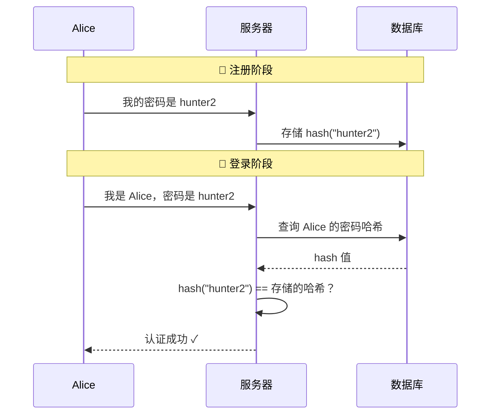

# 01 - 认证的本质与密码的终局

## 1.1 什么是认证？

在信息系统中，有三个基本安全概念（AAA 模型的前两个）：

- **身份标识（Identification）**："我声称我是 Alice"
- **认证（Authentication）**："请证明你确实是 Alice"
- **授权（Authorization）**："Alice 被允许做什么"

**认证 = 验证一个身份声明的真实性。**

从第一性原理出发，证明"你是你"只有三条路径：

| 因素 | 英文术语 | 例子 |
|------|----------|------|
| 你知道什么 | Something you **know** | 密码、PIN、安全问题 |
| 你有什么 | Something you **have** | 手机、硬件密钥、智能卡 |
| 你是什么 | Something you **are** | 指纹、面容、虹膜 |

现代安全体系通常要求 **多因素认证（MFA）**——组合两种以上因素。

---

## 1.2 密码模型：共享秘密

密码认证的本质是 **共享秘密（Shared Secret）** 模型：

:::caution[关键特征]
**Alice 和服务器都知道这个秘密**——即使服务器只存哈希，验证时 Alice 仍然要把明文密码发过去。
:::

---

## 1.3 密码为什么从根本上就是错的

密码的问题不是"用户选了弱密码"——这是症状，不是病因。病因是 **共享秘密模型本身**：

### 问题一：秘密必须传输

每次登录，密码都要从客户端传输到服务器。即使用了 TLS，密码在服务端仍以明文形式短暂存在于内存中。

> 攻击面：网络中间人、TLS 降级、服务端内存转储

### 问题二：秘密在服务端可被批量窃取

服务器存储密码哈希。数据库泄露 = 所有用户的认证凭据同时被盗。

> 现实：2024 年前已有超过 **100 亿条**密码凭据泄露在公开数据库中

### 问题三：秘密可以被复制而不被发现

密码是信息，信息可以无限复制。Alice 不知道她的密码是否已经泄露。

:::tip[类比]
如果有人偷了你的钥匙，你会发现钥匙不见了。如果有人偷了你的密码，**你什么都感觉不到**。
:::

### 问题四：同一秘密被跨站点重用

人类无法记忆数百个高熵随机字符串。结果：密码重用。一个站点泄露 → 所有站点沦陷。

> 统计：约 **65%** 的用户在多个站点重复使用相同或相似的密码

### 问题五：秘密可以被社会工程获取

密码是可言说的知识。钓鱼攻击直接要求用户"说出"秘密。

> 整个过程利用的是：密码是**可传递的知识**。

---

## 1.4 "修补"密码的尝试及其局限

| 修补手段 | 做了什么 | 没解决什么 |
|----------|----------|------------|
| 密码策略（大小写+特殊字符） | 增加暴力破解难度 | 不解决泄露、重用、钓鱼 |
| 密码管理器 | 解决重用和弱密码 | 不解决钓鱼、服务端泄露、传输风险 |
| SMS/TOTP 二次验证 | 增加第二因素 | TOTP 仍是共享秘密；SMS 可被 SIM swap；仍可被实时钓鱼中继 |
| 推送通知 MFA | 改善用户体验 | MFA 疲劳攻击（反复发推送直到用户点"允许"） |

:::danger[核心洞察]
所有这些修补手段都没有改变底层模型——**共享秘密**。它们在一个有缺陷的地基上加固墙壁。
:::

---

## 1.5 我们真正需要的是什么？

回到第一性原理，理想的认证系统应该：

1. **永远不传输秘密** — 即使服务器被完全攻破，也得不到能用于冒充用户的东西
2. **凭据天然绑定站点** — 从协议层面使钓鱼在数学上不可能
3. **凭据不可跨站点关联** — 每个站点看到的是不同的身份标识
4. **不依赖人类记忆** — 认证强度不应取决于用户选择密码的能力
5. **抗重放** — 截获一次认证交互不能用于未来的认证

这些要求指向一个方向：**非对称密码学（公钥密码学）**。

---

## 本课要点

:::note[总结]
- 密码认证 = 共享秘密模型
- 共享秘密的 5 个根本缺陷：**传输、存储、复制、重用、钓鱼**
- 修补密码（策略/管理器/TOTP/推送）不改变底层模型
- 我们需要一个「不共享秘密」的认证模型 → **公钥密码学**
:::

> **下一课**：[02 - 公钥密码学基础](./02-公钥密码学基础.mdx)
