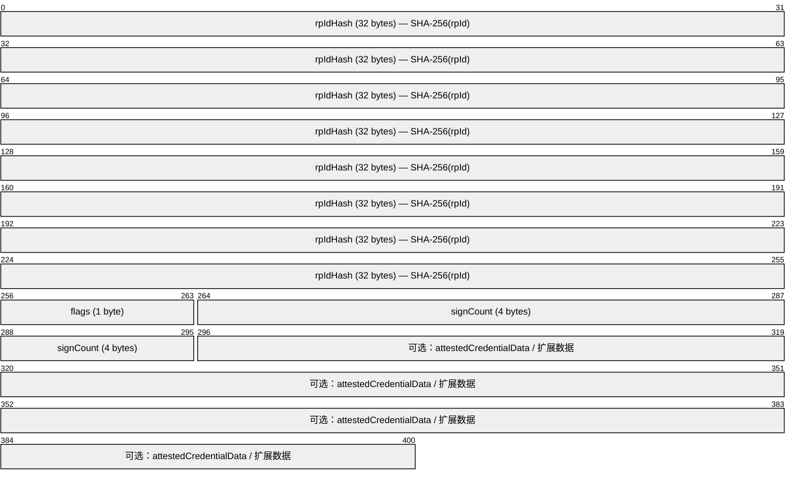
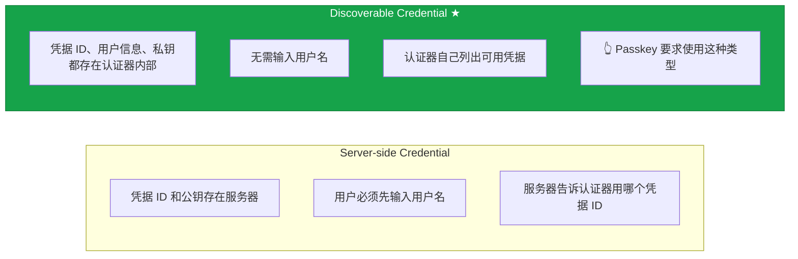

# 05 - WebAuthn：浏览器中的公钥认证

## 5.1 WebAuthn 是什么

WebAuthn（Web Authentication）是 **W3C 标准**，定义了：

1. 浏览器提供给网页的 **JavaScript API**
2. 客户端和服务器之间交换的 **数据格式**

它**不**定义：
- 浏览器如何和认证器通信（那是 CTAP 的事）
- 服务端如何存储凭据（由实现决定）

:::tip
你可以把 WebAuthn 理解为：浏览器暴露给 Web 开发者的「公钥认证接口」。底层的密码学操作由认证器完成，Web 开发者不需要懂密码学，只需要调用 API。
:::

---

## 5.2 两个核心 API

WebAuthn 只有两个 API 调用，对应认证的两个阶段：

| 阶段 | API | 做什么 |
|------|-----|--------|
| 注册 | `navigator.credentials.create()` | 生成密钥对，把公钥给服务器 |
| 认证 | `navigator.credentials.get()` | 用私钥签名挑战，证明身份 |

两个 API 都返回 `Promise`，因为需要等待用户交互（指纹/面容/触摸）。

---

## 5.3 注册 API 详解

### 服务端生成选项

服务端需要构造一组参数传给浏览器：

```javascript
const publicKeyCredentialCreationOptions = {
  // 挑战：32+ 字节随机数，防重放
  challenge: new Uint8Array([/* 服务端生成的随机字节 */]),

  // 依赖方信息
  rp: {
    id: "example.com",        // RP ID，凭据绑定到此域名
    name: "Example Corp"      // 显示名称（给用户看的）
  },

  // 用户信息
  user: {
    id: new Uint8Array([/* 用户唯一标识，不透明字节串 */]),
    name: "alice@example.com",     // 登录用的用户名
    displayName: "Alice Johnson"   // 显示名称
  },

  // 服务端支持的公钥算法（按优先级排列）
  pubKeyCredParams: [
    { alg: -7,  type: "public-key" },   // ES256 (ECDSA P-256)
    { alg: -257, type: "public-key" }   // RS256 (RSA)
  ],

  timeout: 60000,

  // 认证器选择条件
  authenticatorSelection: {
    authenticatorAttachment: "platform",  // 仅平台认证器
    residentKey: "required",              // Passkey 需要这个
    userVerification: "required"          // "required" | "preferred" | "discouraged"
  },

  // 排除已注册的凭据（防止重复注册）
  excludeCredentials: [
    { id: new Uint8Array([/* 已有凭据 ID */]), type: "public-key" }
  ],

  // 证明偏好
  attestation: "none"   // "none" | "indirect" | "direct" | "enterprise"
};
```

### 前端调用

```javascript
const credential = await navigator.credentials.create({
  publicKey: publicKeyCredentialCreationOptions
});
```

此时浏览器会：验证 RP ID 匹配 → 通过 CTAP 与认证器通信 → 弹出用户验证 → 认证器生成密钥对 → 返回凭据对象。

### 返回值结构

```javascript
credential = {
  id: "base64url 编码的凭据 ID",
  rawId: ArrayBuffer,
  type: "public-key",
  response: {
    clientDataJSON: ArrayBuffer,    // 客户端上下文数据（JSON）
    attestationObject: ArrayBuffer  // 包含公钥 + 证明声明（CBOR 编码）
  },
  authenticatorAttachment: "platform"
};
```

---

## 5.4 认证 API 详解

### 服务端生成选项

```javascript
const publicKeyCredentialRequestOptions = {
  challenge: new Uint8Array([/* 新的随机字节 */]),
  rpId: "example.com",
  timeout: 60000,
  // 为空或省略 → Discoverable Credential 模式（无用户名登录）
  allowCredentials: [
    { id: new Uint8Array([/* 凭据 ID */]), type: "public-key", transports: ["internal", "hybrid"] }
  ],
  userVerification: "required"
};
```

### 返回值结构

```javascript
assertion = {
  id: "base64url 编码的凭据 ID",
  rawId: ArrayBuffer,
  type: "public-key",
  response: {
    clientDataJSON: ArrayBuffer,       // 客户端上下文
    authenticatorData: ArrayBuffer,    // rpIdHash + flags + signCount
    signature: ArrayBuffer,            // 签名
    userHandle: ArrayBuffer            // 注册时的 user.id
  }
};
```

---

## 5.5 clientDataJSON：客户端上下文

两个 API 都会生成 `clientDataJSON`，它是防钓鱼的核心数据：

```json
{
  "type": "webauthn.create",
  "challenge": "base64url编码的挑战",
  "origin": "https://example.com",
  "crossOrigin": false
}
```

:::danger[最重要的字段]
`origin` 字段由浏览器根据当前页面的实际来源填入，**JavaScript 无法修改它**。这就是为什么 WebAuthn 从协议层面防钓鱼——假网站的 origin 不同，服务器验证会失败。
:::

---

## 5.6 authenticatorData：认证器数据



**flags 的各个 bit**：

| Bit | 名称 | 含义 |
|-----|------|------|
| 0 | **UP** | User Present — 用户存在（触摸/交互） |
| 2 | **UV** | User Verified — 用户已验证（生物特征/PIN） |
| 3 | **BE** | Backup Eligible — 凭据可被备份/同步（**Passkey 标志**） |
| 4 | **BS** | Backup State — 凭据已被备份/同步 |
| 6 | AT | Attested Credential Data included |
| 7 | ED | Extension Data included |

:::info
BE 和 BS 标志是 2022 年为 Passkey 新增的——服务器可以据此判断凭据是否是同步凭据。
:::

---

## 5.7 证明（Attestation）

注册时，认证器可以提供 **证明声明（Attestation Statement）**，证明"这个公钥确实是由某个特定型号的认证器生成的"。

> 证明 ≈ 认证器的"出生证明"——认证器在出厂时被烧入一个证明密钥，注册时用这个密钥签名凭据数据。

| 类型 | 说明 |
|------|------|
| **None** | 不提供证明（最常见，隐私友好） |
| Self | 用新生成的凭据私钥自签名 |
| Packed | FIDO2 标准证明格式 |
| TPM | Windows TPM 证明 |
| Android Key | Android 密钥库证明 |
| Apple | Apple App Attest |

:::tip[实践建议]
除非你是银行或政府机构需要确认用户使用的是特定认证器，否则使用 `attestation: "none"`。证明会泄露认证器型号信息，涉及隐私问题。
:::

---

## 5.8 凭据类型：Server-side vs Discoverable



:::info[无用户名登录流程]
1. 用户点击"使用 Passkey 登录"
2. 操作系统弹出可用的 Passkey 列表
3. 用户选择账户 → 指纹验证
4. 登录完成

整个过程**没有输入用户名和密码**。
:::

---

## 本课要点

:::note[总结]
- WebAuthn = W3C 标准，定义浏览器端 JS API + 数据格式
- 只有两个 API：`create()`（注册）和 `get()`（认证）
- `clientDataJSON` 包含 origin — 浏览器自动填入，防钓鱼核心
- `authenticatorData` 包含 rpIdHash + flags + signCount
- BE/BS 标志标识 Passkey（同步凭据）
- 证明（Attestation）= 认证器的"出生证明"，大多数场景用 `"none"`
- Discoverable Credential = 凭据存在认证器内 → **无用户名登录**
:::

> **下一课**：[06 - CTAP：客户端与认证器协议](./06-CTAP客户端与认证器协议.mdx)
