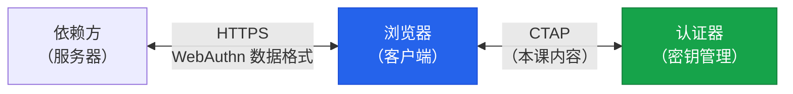
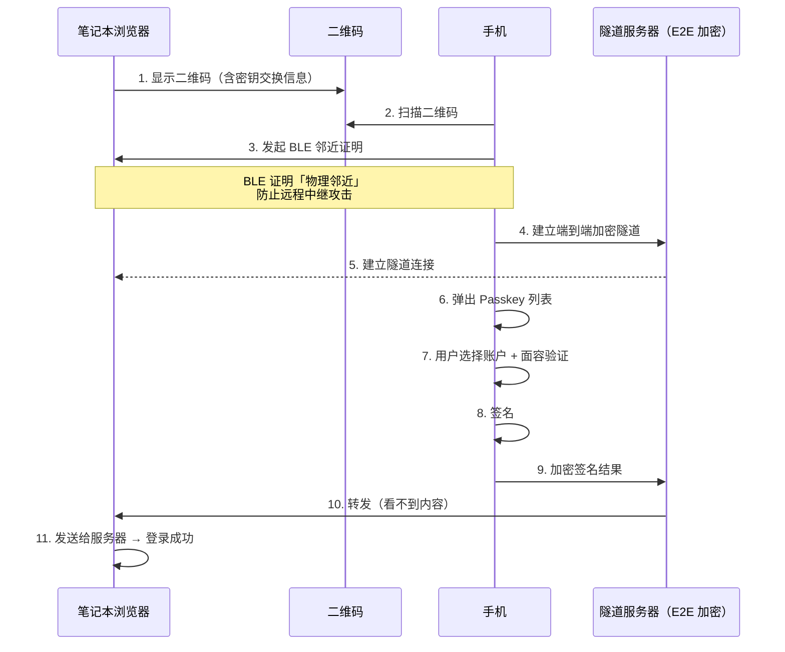
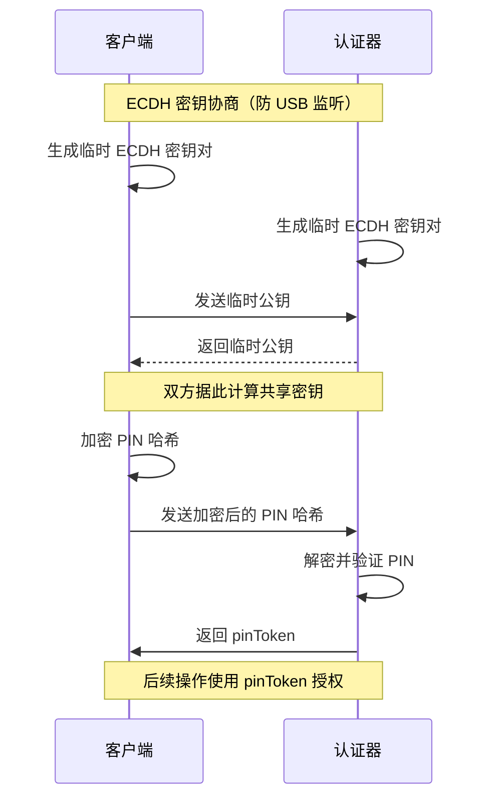
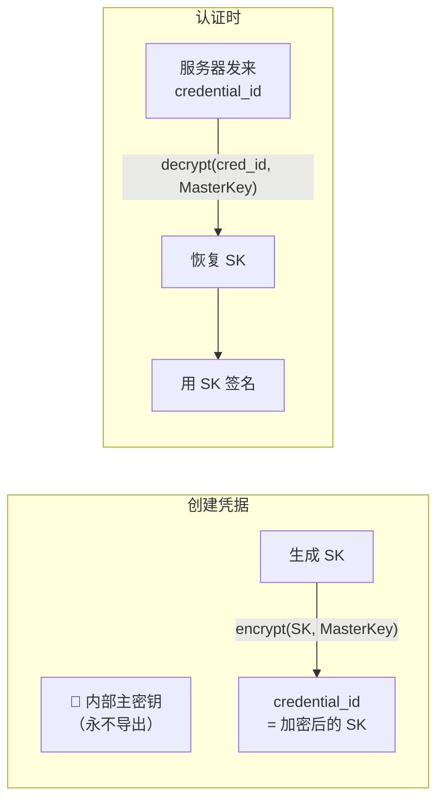

# 06 - CTAP：客户端与认证器协议

## 6.1 CTAP 在架构中的位置



> **CTAP = Client to Authenticator Protocol**。WebAuthn 定义了「浏览器 ↔ 服务器」的接口，CTAP 定义了「浏览器 ↔ 认证器」的接口。

---

## 6.2 CTAP 版本

| 版本 | 别名 | 能力 |
|------|------|------|
| CTAP1 | U2F | 仅第二因素，仅 USB HID |
| CTAP2 | FIDO2 | 完整能力：PIN、生物特征、驻留凭据 |
| CTAP 2.1 | — | 凭据管理、企业证明、改进 PIN 协议 |
| CTAP 2.2 | — | **Hybrid 传输**（手机作为认证器）、信号 API |

大多数现代认证器同时支持 CTAP1（向后兼容）和 CTAP2。

---

## 6.3 传输层：认证器如何连接

### USB HID

最经典的方式：插入 USB 安全密钥。使用 USB HID（Human Interface Device）协议，认证器表现为一个 HID 设备（类似键盘/鼠标），无需安装驱动。

### NFC

近场通信。手机轻触安全密钥即可通信。常见场景：手机 + YubiKey NFC，距离 < 4cm。

### BLE（蓝牙低功耗）

蓝牙连接，不需要物理接触。较少使用（配对体验差，安全性较低），正在被 Hybrid 传输取代。

### Internal（平台内部）

不走 CTAP，走平台内部 API。例如：浏览器直接调用 macOS Keychain / Windows Hello / Android Keystore。没有物理传输层——操作系统内部通信。

### Hybrid（混合传输）— 最重要的新传输

场景：在笔记本上登录网站，用手机作为认证器。



:::info[关键安全性质]
- 手机的私钥**从未离开手机**
- BLE 邻近要求防止远程攻击
- 端到端加密——隧道服务器看不到认证数据内容
- 隧道服务器由平台厂商运行（Apple / Google），仅中继加密流量
:::

Hybrid 传输是 Passkey 跨设备体验的核心——让你能用手机里的 Passkey 登录任何设备上的网站。

---

## 6.4 CTAP2 命令

CTAP2 使用 CBOR（Concise Binary Object Representation）编码消息：

| 命令 | 功能 |
|------|------|
| `authenticatorMakeCredential` | 创建新凭据（对应 WebAuthn create） |
| `authenticatorGetAssertion` | 生成认证断言（对应 WebAuthn get） |
| `authenticatorGetInfo` | 查询认证器能力和配置 |
| `authenticatorClientPIN` | PIN 设置和验证 |
| `authenticatorCredentialManagement` | 管理存储的驻留凭据（CTAP 2.1+） |
| `authenticatorSelection` | 确认设备存在（闪灯等） |
| `authenticatorReset` | 恢复出厂设置 |

---

## 6.5 PIN 协议

外部认证器（如 YubiKey）没有指纹传感器，如何做用户验证？→ **PIN**



:::warning[PIN 安全机制]
- PIN 的明文**永远不在 USB 线上传输**
- 重试次数有限：默认 8 次，之后需 reboot；总共 3 轮后**永久锁定**
:::

---

## 6.6 认证器内部：密钥如何存储

### 方式一：专用存储（Resident Key / Discoverable）

```
认证器有有限的存储空间（如 YubiKey 5 约 25 个 Passkey 槽位）
每个凭据占一个槽位：凭据 ID、私钥、RP ID、用户信息

✓ 支持无用户名登录
✗ 存储空间有限
```

### 方式二：密钥包装（Key Wrapping）



> 凭据 ID **本身就是加密后的私钥**！优点：无限凭据数量。缺点：需要服务器提供凭据 ID，不支持无用户名登录。

实际上，许多认证器**混合使用**两种方式：驻留凭据用专用存储，非驻留凭据用密钥包装。

---

## 6.7 平台认证器的特殊之处

平台认证器不走 CTAP 的物理传输层：

| 平台 | 调用路径 | 安全硬件 | 特点 |
|------|----------|----------|------|
| macOS/iOS | 浏览器 → Security.framework → Secure Enclave | Secure Enclave | 即使 root 也无法提取私钥 |
| Windows | 浏览器 → Windows Hello API → TPM | TPM | 私钥存在 TPM 中 |
| Android | 浏览器 → Android Keystore → TEE/StrongBox | TEE / StrongBox | StrongBox = 独立安全芯片 |

---

## 本课要点

:::note[总结]
- CTAP = 浏览器与认证器之间的协议
- 传输方式：USB HID、NFC、BLE、Internal、**Hybrid**
- Hybrid 传输 = 二维码 + BLE 邻近证明 + 云端隧道 → **跨设备 Passkey 的核心**
- CTAP2 用 CBOR 编码，支持 PIN、生物特征、驻留凭据
- PIN 通过 ECDH 安全传输，永不以明文出现在线上
- 密钥存储：专用存储（有限但支持无用户名）vs 密钥包装（无限但需凭据 ID）
- 平台认证器走 OS 内部 API → 安全硬件（SE / TPM / TEE）
:::

> **下一课**：[07 - 注册流程深度拆解](./07-注册流程深度拆解.mdx)
