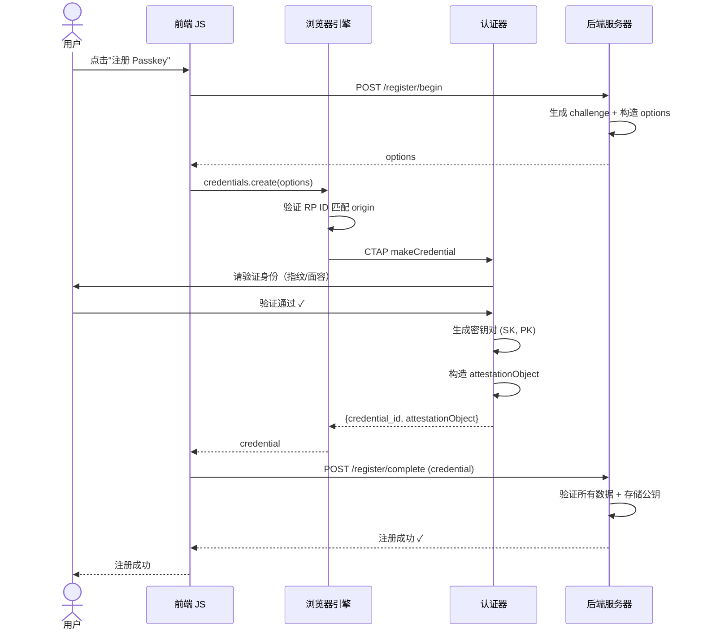
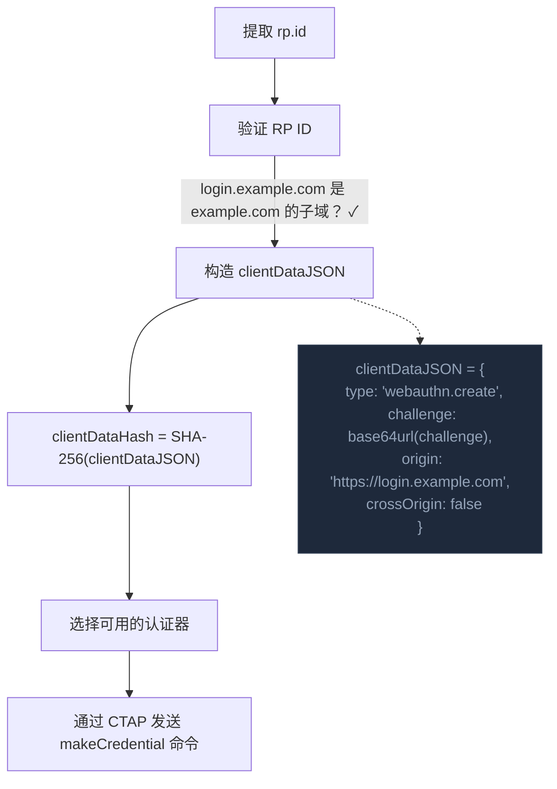

# 07 - 注册流程深度拆解

## 7.1 全景时序图



---

## 7.2 第一步：服务端生成注册选项

```python
# 伪代码：服务端逻辑

def register_begin(user):
    # 1. 生成挑战（至少 16 字节，推荐 32 字节）
    challenge = os.urandom(32)

    # 2. 存储挑战（用于后续验证，通常放 session 或临时存储）
    session[user.id].pending_challenge = challenge

    # 3. 查询用户已有凭据（防重复注册）
    existing_creds = db.get_credentials(user.id)

    # 4. 构造选项
    options = {
        "challenge": challenge,
        "rp": { "id": "example.com", "name": "Example Corp" },
        "user": {
            "id": user.unique_id,        # 不透明字节串，不是邮箱！
            "name": user.email,
            "displayName": user.display_name
        },
        "pubKeyCredParams": [
            {"alg": -7, "type": "public-key"},     # ES256
            {"alg": -8, "type": "public-key"},      # EdDSA
            {"alg": -257, "type": "public-key"}     # RS256
        ],
        "authenticatorSelection": {
            "residentKey": "required",              # Passkey 需要
            "userVerification": "required"
        },
        "excludeCredentials": [
            {"id": c.credential_id, "type": "public-key"}
            for c in existing_creds
        ],
        "attestation": "none",
        "timeout": 60000
    }
    return options
```

:::warning[user.id 的重要细节]
`user.id` 必须是**不透明的字节串**（opaque byte string）：

| | 做法 |
|---|------|
| ✗ | 邮箱地址 `"alice@example.com"` — 换认证器时隐私泄露 |
| ✗ | 自增 ID `"12345"` — 可被枚举 |
| ✓ | **随机 UUID** 或类似的不可关联标识符 |
:::

---

## 7.3 第二步：浏览器处理

浏览器收到选项后执行 `navigator.credentials.create()`：



---

## 7.4 第三步：认证器执行

认证器收到 `makeCredential` 命令后：

1. **检查 excludeCredentials** — 已存在匹配凭据则报错（防重复注册）
2. **要求用户验证（UV）** — Touch ID / Face ID / PIN + 触摸
3. **生成新的密钥对** — `(SK, PK) = generateKeyPair(algorithm)`
4. **存储驻留凭据**（如果 `residentKey=required`）
5. **构造 authenticatorData**：

```
rpIdHash = SHA-256("example.com")           // 32 bytes
flags = UP | UV | AT | BE | BS              // 1 byte
signCount = 0                               // 4 bytes
attestedCredentialData = {
  aaguid: 认证器型号标识                     // 16 bytes
  credentialIdLength + credentialId          // 2 + N bytes
  credentialPublicKey: PK (COSE 格式)        // 变长
}
```

6. **构造 attestationObject**（CBOR 编码）：

```json
{
  "fmt": "none",
  "attStmt": {},
  "authData": "<authenticatorData 字节>"
}
```

### COSE 公钥格式

公钥使用 COSE（CBOR Object Signing and Encryption）格式编码：

```javascript
// ES256 (P-256) 公钥的 COSE 编码
{
  1: 2,        // kty: EC2（椭圆曲线）
  3: -7,       // alg: ES256
  -1: 1,       // crv: P-256
  -2: x坐标,   // x: 32 bytes
  -3: y坐标    // y: 32 bytes
}
// 注意：COSE 使用整数作为 key（不是字符串），这是 CBOR 的特点
```

---

## 7.5 第四步：服务端验证

:::danger[最关键的一步]
服务端必须严格验证所有返回数据——任何一个检查缺失都可能导致安全漏洞。
:::

```python
def register_complete(credential_response):

    # 1. 解码 clientDataJSON
    client_data = json.decode(credential_response.clientDataJSON)

    # 2. 验证 type
    assert client_data["type"] == "webauthn.create"

    # 3. 验证 challenge（防重放）
    assert base64url_decode(client_data["challenge"]) == session.pending_challenge
    del session.pending_challenge  # 用完立即删除

    # 4. 验证 origin（防钓鱼）★★★
    assert client_data["origin"] in ALLOWED_ORIGINS

    # 5. 解码 attestationObject（CBOR）
    att_obj = cbor.decode(credential_response.attestationObject)
    auth_data = parse_authenticator_data(att_obj["authData"])

    # 6. 验证 rpIdHash
    assert auth_data.rpIdHash == SHA256("example.com")

    # 7. 验证 flags
    assert auth_data.flags.UP == true    # 用户存在
    assert auth_data.flags.UV == true    # 用户已验证

    # 8. 提取公钥
    public_key = auth_data.attestedCredentialData.credentialPublicKey

    # 9. 验证证明（如果不是 "none"）
    if att_obj["fmt"] != "none":
        verify_attestation(att_obj)

    # 10. 检查凭据 ID 是否已存在（防止重复）
    credential_id = auth_data.attestedCredentialData.credentialId
    assert not db.credential_exists(credential_id)

    # 11. 存储凭据
    db.store_credential({
        "user_id": current_user.id,
        "credential_id": credential_id,
        "public_key": public_key,
        "sign_count": auth_data.signCount,
        "transports": credential_response.transports,
        "backup_eligible": auth_data.flags.BE,
        "backup_state": auth_data.flags.BS,
        "created_at": now()
    })

    return {"status": "ok"}
```

---

## 7.6 服务端存储了什么

| 字段 | 说明 |
|------|------|
| `user_id` | 用户唯一标识 |
| `credential_id` | 凭据 ID（认证时需要） |
| `public_key` | 公钥（COSE 格式） |
| `sign_count` | 签名计数器 |
| `transports` | 支持的传输方式 |
| `backup_eligible` | 是否可同步（BE 标志） |
| `backup_state` | 是否已同步（BS 标志） |
| `created_at` | 注册时间 |
| `last_used_at` | 最后使用时间 |

:::tip
服务器存储的 `public_key` **不是秘密**。即使整个数据库被盗，攻击者也无法伪造签名。这与密码哈希泄露（可以离线暴力破解）有**本质区别**。
:::

---

## 本课要点

:::note[总结]
- 注册流程 = 4 步：服务端生成选项 → 浏览器处理 → 认证器生成密钥 → 服务端验证
- `user.id` 必须是不透明字节串，不能用邮箱或自增 ID
- 浏览器自动填入 origin，认证器自动计算 rpIdHash
- 认证器生成密钥对，**私钥永不离开认证器**（或安全硬件）
- 公钥用 COSE 格式（基于 CBOR）编码
- 服务端必须验证：type、challenge、origin、rpIdHash、flags
- 服务端存储公钥——不是秘密，泄露无影响
:::

> **下一课**：[08 - 认证流程深度拆解](./08-认证流程深度拆解.mdx)
