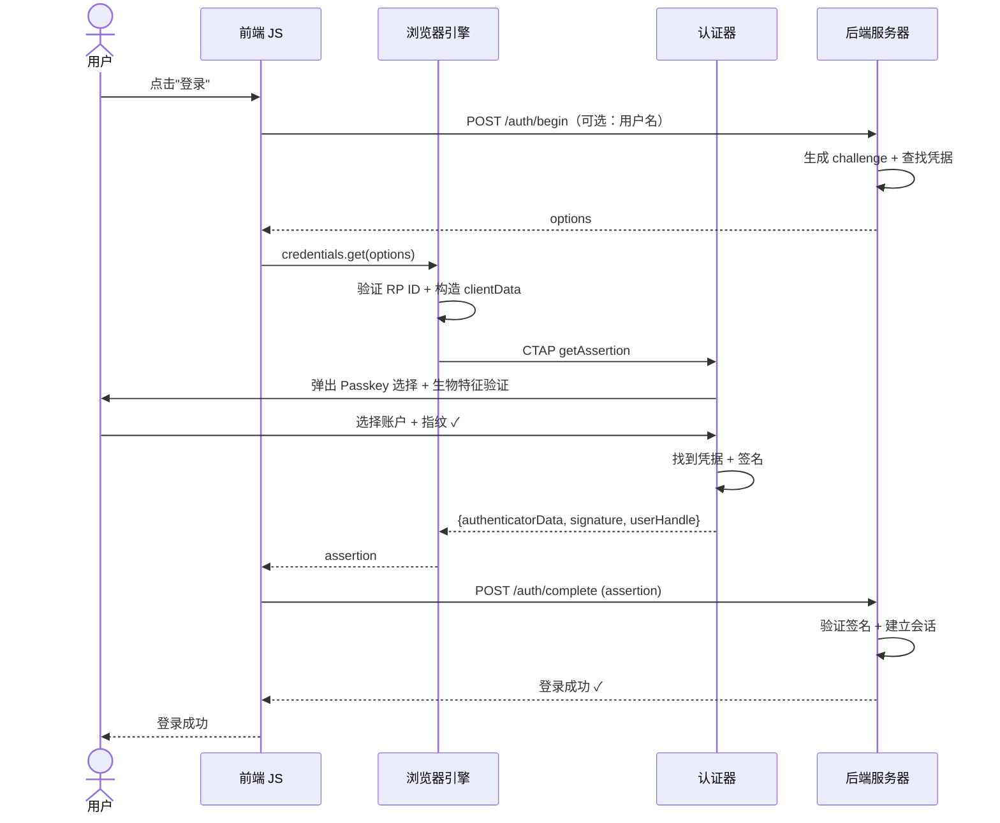
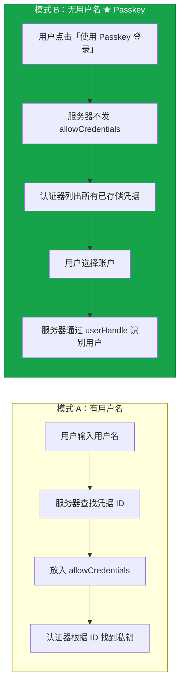
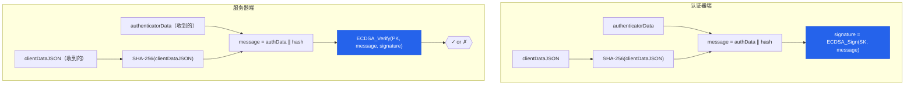
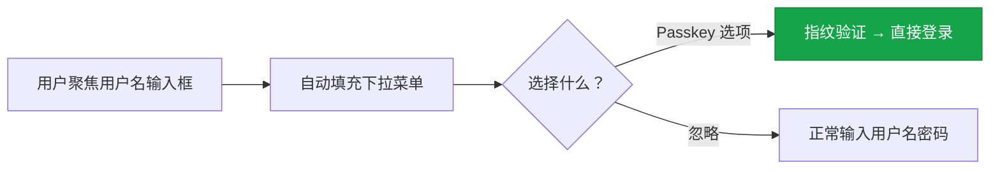

# 08 - 认证流程深度拆解

## 8.1 全景时序图



---

## 8.2 两种认证模式



模式 B 是 Passkey 的典型体验——**真正的无密码 + 无用户名**。

---

## 8.3 第一步：服务端生成认证选项

```python
def auth_begin(username=None):
    challenge = os.urandom(32)
    session.pending_challenge = challenge

    options = {
        "challenge": challenge,
        "rpId": "example.com",
        "timeout": 60000,
        "userVerification": "required"
    }

    if username:
        # 模式 A：指定凭据
        user = db.get_user(username)
        credentials = db.get_credentials(user.id)
        options["allowCredentials"] = [
            {
                "id": c.credential_id,
                "type": "public-key",
                "transports": c.transports  # ["internal", "hybrid"] 等
            }
            for c in credentials
        ]
    else:
        # 模式 B：Discoverable Credential（无用户名）
        options["allowCredentials"] = []

    return options
```

:::info[transports 字段的作用]
告诉浏览器这个凭据可以通过什么传输方式使用，浏览器用来**优化 UI**：

| 值 | 含义 | UI 行为 |
|----|------|---------|
| `"internal"` | 平台认证器 | 直接弹出 Touch ID |
| `"hybrid"` | 手机扫码 | 显示二维码选项 |
| `"usb"` | USB 安全密钥 | 提示插入安全密钥 |
| `"ble"` | 蓝牙 | 蓝牙配对提示 |
| `"nfc"` | 近场通信 | NFC 触碰提示 |
:::

---

## 8.4 第二步：浏览器和认证器处理

**浏览器**：验证 rpId 匹配 → 构造 `clientDataJSON`（type=`"webauthn.get"`，包含 origin）→ `clientDataHash = SHA-256(clientDataJSON)` → 发送 CTAP getAssertion

**认证器**：

1. 根据 rpId 查找匹配的凭据
2. 如果有多个 → 让用户选择
3. 要求用户验证（指纹/面容/PIN）
4. 构造 `authenticatorData`（rpIdHash + flags + signCount，**认证时无 attestedCredentialData**）
5. 计算签名：`signature = sign(authenticatorData + clientDataHash, SK)`
6. 返回 `{authenticatorData, signature, userHandle}`

---

## 8.5 第三步：服务端验证（最关键）

```python
def auth_complete(assertion_response):

    # ===== 解码 clientDataJSON =====
    client_data = json.decode(assertion_response.clientDataJSON)

    # 1. 验证 type
    assert client_data["type"] == "webauthn.get"

    # 2. 验证 challenge
    assert base64url_decode(client_data["challenge"]) == session.pending_challenge
    del session.pending_challenge

    # 3. 验证 origin ★★★
    assert client_data["origin"] in ALLOWED_ORIGINS

    # ===== 查找凭据 =====
    credential_id = assertion_response.rawId
    # Discoverable 模式：通过 userHandle 识别用户
    credential = db.get_credential(credential_id)
    assert credential is not None

    # ===== 解析 authenticatorData =====
    auth_data = parse_authenticator_data(assertion_response.authenticatorData)

    # 5. 验证 rpIdHash
    assert auth_data.rpIdHash == SHA256("example.com")

    # 6. 验证 flags
    assert auth_data.flags.UP == true
    assert auth_data.flags.UV == true  # 如果 required

    # ===== 验证签名 ★★★ 核心步骤 ★★★ =====
    client_data_hash = SHA256(assertion_response.clientDataJSON)  # 对原始字节哈希
    signature_base = assertion_response.authenticatorData + client_data_hash
    valid = verify_signature(
        public_key=credential.public_key,
        signature=assertion_response.signature,
        data=signature_base
    )
    assert valid == true

    # ===== 签名计数器检查 =====
    if auth_data.signCount != 0 or credential.sign_count != 0:
        if auth_data.signCount <= credential.sign_count:
            raise SecurityAlert("Possible credential cloning detected")
        credential.sign_count = auth_data.signCount

    # ===== 建立会话 =====
    session.user_id = credential.user_id
    return {"status": "ok"}
```

---

## 8.6 签名验证的数学



> 如果签名有效 → 持有 SK 的实体确实签了这些数据 → SK 只存在于认证器中 → 用户确实在场并使用了正确的认证器。

---

## 8.7 为什么签 authenticatorData + hash(clientDataJSON)？

:::tip[为什么不直接签 challenge？]
因为签名需要绑定**多个**上下文信息：

| 数据来源 | 包含内容 | 保护目标 |
|----------|----------|----------|
| **authenticatorData** | rpIdHash | 绑定到网站域名 |
| | flags | 证明用户在场并验证了身份 |
| | signCount | 克隆检测 |
| **clientDataJSON** | challenge | 防重放 |
| | origin | 防钓鱼 |
| | type | 防混淆（create 签名不能当 get 用） |

所有这些信息都被签名覆盖 → **任何一个被篡改都会导致签名验证失败**。
:::

---

## 8.8 条件式 UI（Conditional Mediation）

现代浏览器支持一种更优雅的 Passkey 登录体验：

```javascript
// HTML: <input autocomplete="username webauthn">

const assertion = await navigator.credentials.get({
  publicKey: {
    challenge: challengeFromServer,
    rpId: "example.com",
    userVerification: "required"
  },
  mediation: "conditional"    // ★ 关键参数
});
```



:::info[渐进式部署的最佳方式]
Conditional UI 不破坏现有的用户名+密码流程，同时为已注册 Passkey 的用户提供快捷登录。不弹出模态对话框，Passkey 选项出现在自动填充建议中。
:::

---

## 本课要点

:::note[总结]
- 认证有两种模式：有用户名（`allowCredentials`）和无用户名（Discoverable）
- 无用户名模式 = Passkey 的典型体验
- 签名覆盖 `authenticatorData + hash(clientDataJSON)` → 同时绑定域名、挑战、来源
- 服务端必须验证：type、challenge、origin、rpIdHash、flags、signature、signCount
- `signCount ≤ 上次记录` → 疑似凭据克隆
- Conditional Mediation = 在自动填充中显示 Passkey → 渐进式部署
:::

> **下一课**：[09 - Passkey：同步凭据与无密码未来](./09-Passkey同步凭据与无密码未来.mdx)
