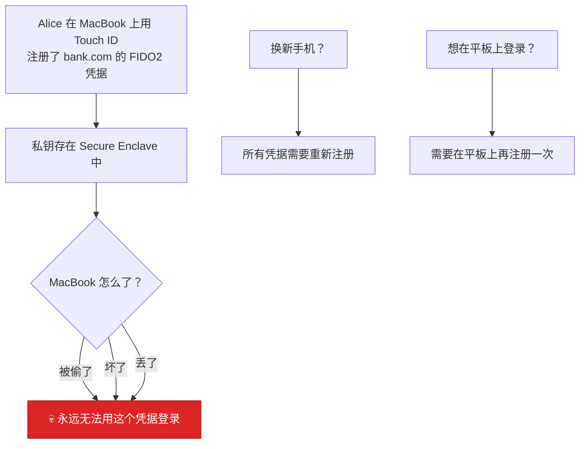
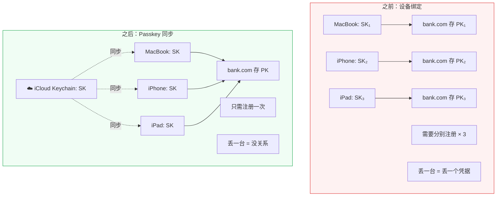
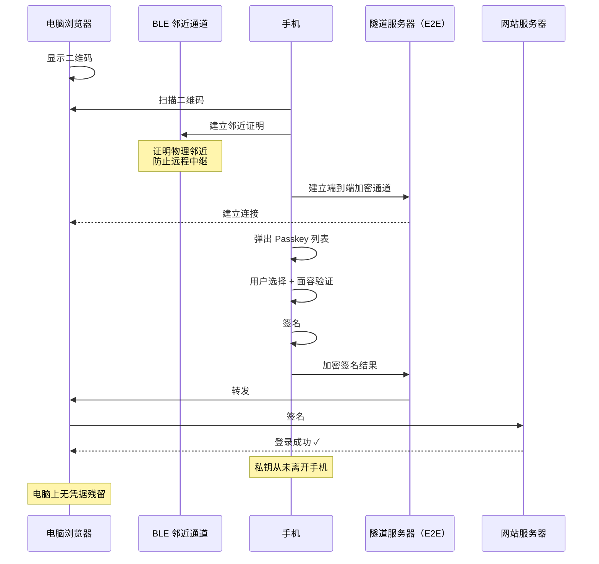
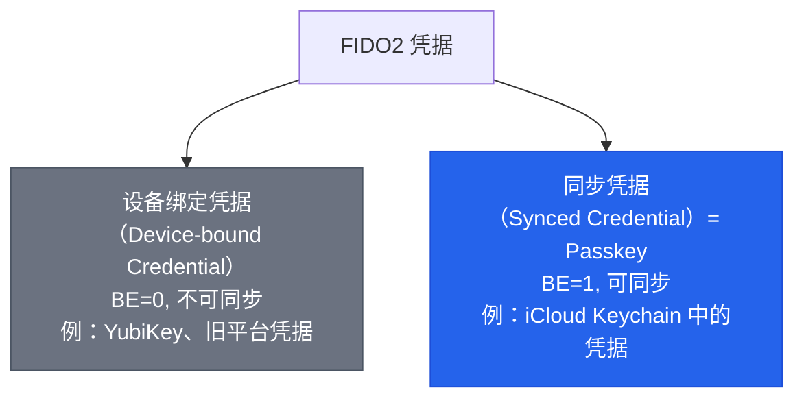

# 09 - Passkey：同步凭据与无密码未来

## 9.1 传统 FIDO2 凭据的困境

在 Passkey 出现之前，FIDO2 凭据面临一个根本性的用户体验难题：



:::danger[核心矛盾]
密码的最大优势是跨设备可用（只要你记得），而传统 FIDO2 凭据**绑定在单一设备上**。这就是为什么 FIDO2 在 Passkey 之前无法真正替代密码。
:::

---

## 9.2 Passkey = 可同步的 FIDO2 凭据

**Passkey 的核心创新：允许 FIDO2 凭据跨设备同步。**

> Passkey = Discoverable Credential + 跨设备同步

同步机制由平台厂商提供：Apple（iCloud Keychain）、Google（Password Manager）、Microsoft（Microsoft 账户）、第三方（1Password、Bitwarden、Dashlane 等）。

### 同步改变了什么



---

## 9.3 同步的安全性

### "私钥同步了，那还安全吗？"

这是最常见的质疑。答案需要分层看：

| 层次 | 保护机制 | 说明 |
|------|----------|------|
| **传输安全** | 端到端加密 | Apple/Google 的服务器看到的是密文，无法解密 |
| **存储安全** | 安全硬件 | 同步后私钥仍存在 Secure Enclave / Titan M2 / TPM 中 |
| **访问控制** | 本地用户验证 | 解锁设备 + 生物特征，拿到设备但无法通过验证 → 无法使用 |

### 威胁模型对比

| 威胁 | 密码 | Passkey 同步 |
|------|------|-------------|
| 钓鱼 | ✗ 脆弱 | **✓ 不可能（域名绑定）** |
| 服务端泄露 | ✗ 可离线破解哈希 | **✓ 只存公钥** |
| 重用 | ✗ 常见 | **✓ 每站点独立密钥** |
| 中间人 | ✗ 可中继 | **✓ origin 绑定** |
| 云端泄露 | ✗ 明文或弱加密 | △ 端到端加密 |
| 设备丢失 | △ 密码在脑子里 | **✓ 其他设备仍有** |

:::info
同步引入了「云端存储」作为新的攻击面，但消除了密码模型的**所有根本缺陷**。净安全收益是显著正向的。
:::

---

## 9.4 BE/BS 标志：服务端如何识别 Passkey

WebAuthn Level 3 引入了两个新的 authenticatorData 标志：

| BE | BS | 含义 |
|:---:|:---:|------|
| 0 | 0 | 设备绑定凭据（YubiKey、旧平台凭据） |
| 1 | 0 | 可同步但尚未同步（刚创建还没同步） |
| **1** | **1** | **已同步的 Passkey（典型状态）** |
| 0 | 1 | 非法组合（不应出现） |

### 服务端策略

```python
# 注册时检查
if auth_data.flags.BE:
    # 这是 Passkey（可同步凭据）
    # 可能不需要要求用户注册备用认证方式
    pass
else:
    # 设备绑定凭据 → 强烈建议注册第二个凭据作为备用
    prompt_backup_credential()

# signCount 策略
if auth_data.flags.BE:
    # 同步凭据的 signCount 通常为 0 或不可靠
    # 不应依赖 signCount 做克隆检测
    skip_sign_count_check()
else:
    # 设备绑定凭据，正常检查 signCount
    check_sign_count()
```

---

## 9.5 跨设备认证（Cross-Device Authentication）

场景：在公共电脑上登录，用手机里的 Passkey 认证。



---

## 9.6 Passkey 的生态现状

### 平台支持

| 平台 | 支持版本 | 同步方式 |
|------|----------|----------|
| Apple | iOS 16+ / macOS Ventura+ | iCloud Keychain |
| Google | Android 9+ (Play Services) | Google Password Manager |
| Microsoft | Windows 10/11 | Windows Hello / Microsoft 账户 |
| 第三方 | 各密码管理器 | 1Password、Bitwarden、Dashlane 等 |

### 主要网站支持

Google, Apple, Microsoft, Amazon, GitHub, GitLab, PayPal, eBay, Cloudflare, Shopify, Adobe, X (Twitter), LinkedIn, TikTok, Coinbase 等。完整列表见 [passkeys.directory](https://passkeys.directory)。

---

## 9.7 Passkey 与密码管理器的关系


:::tip
1Password 等第三方密码管理器可以在 Apple + Android + Windows 之间同步 Passkey，**打破平台厂商的生态壁垒**。
:::

---

## 9.8 术语澄清



> **Passkey（狭义）** = 同步凭据。**Passkey（广义，行业用法）** = 所有基于 FIDO2 的凭据。实践中，"Passkey" 越来越成为面向用户的统一术语——用户不需要知道 "FIDO2" 或 "WebAuthn"，只需要知道 "Passkey" = "不用密码就能登录的东西"。

---

## 本课要点

:::note[总结]
- 传统 FIDO2 的困境：设备绑定 → 丢设备 = 丢凭据
- **Passkey = FIDO2 Discoverable Credential + 跨设备同步**
- 同步通过端到端加密实现，私钥在安全硬件中存储
- BE/BS 标志让服务端区分同步凭据和设备绑定凭据
- 同步凭据的 signCount 不可靠，不应用于克隆检测
- 跨设备认证 = Hybrid 传输（二维码 + BLE 邻近 + 加密隧道）
- 第三方密码管理器可作为跨平台 Passkey 提供商
:::

> **下一课**：[10 - 安全模型与威胁分析](./10-安全模型与威胁分析.mdx)
