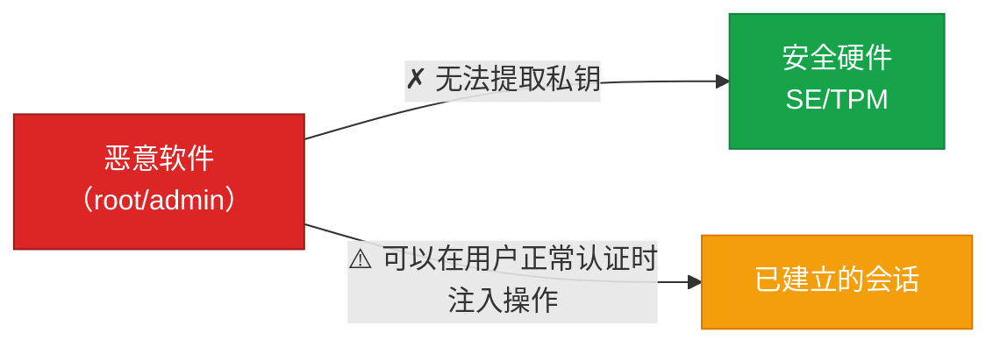
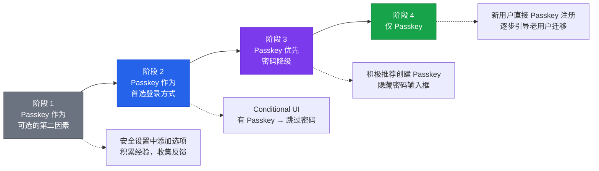

# 10 - 安全模型与威胁分析

## 10.1 Passkey 的安全性质总览

:::tip[回顾第一课的安全目标]
| 目标 | 是否达成 | 实现机制 |
|------|:--------:|----------|
| 永远不传输秘密 | ✓ | 只传签名，私钥从不离开认证器 |
| 凭据绑定站点 | ✓ | rpIdHash + origin 绑定 |
| 凭据不可跨站点关联 | ✓ | 每站独立密钥对 |
| 不依赖人类记忆 | ✓ | 私钥由设备管理 |
| 抗重放 | ✓ | 一次性随机挑战 |
:::

---

## 10.2 Passkey 能防御的攻击

### 1. 钓鱼（Phishing）→ 完全防御

凭据绑定到 `rpId = "bank.com"`，浏览器自动填入 origin，认证器只在 rpId 匹配时响应。

:::danger[效果]
钓鱼在**数学上**不可能成功——不是"提醒用户注意"，而是**协议层面阻止**。
:::

### 2. 凭据填充 / 暴力破解 → 完全防御

不存在密码 → 没有东西可以"填充"。每站独立密钥对，私钥是 256-bit 随机数（2^256 种可能）。

### 3. 服务端数据库泄露 → 完全防御

密码模型：泄露哈希 → 离线破解 → 恢复明文 → 登录。
Passkey 模型：泄露公钥 → **无法推导私钥** → 无法签名 → 游戏结束。

### 4. 中间人 / 实时钓鱼中继 → 完全防御

Evilginx/Modlishka 等工具对 TOTP 有效，但对 Passkey 无效：`origin = "https://evil-proxy.com" ≠ "https://bank.com"` → 认证器拒绝签名。

### 5. 密码重用 → 从根本上消除

协议设计使每站点**自动使用**不同密钥对，用户无需做任何事。

### 6. SIM Swap 攻击 → 完全防御

Passkey 不使用 SMS → 攻击面不存在。

---

## 10.3 Passkey 无法防御或部分防御的威胁

### 1. 设备被完全控制（Endpoint Compromise）

> 这不是 Passkey 特有的问题——设备被完全控制时，**任何**认证方式都无法保护用户。

### 2. 社会工程（Social Engineering）

Passkey 显著减少了社工攻击面（没有可"说出来"的密码），但无法完全防御用户**主动配合**的社工场景（如被说服在自己设备上"帮忙验证"）。

### 3. 云账户被攻破

攻击者获得 Apple ID / Google 账户控制权 → 可能访问同步的 Passkey，但仍需通过本地用户验证（生物特征）。

:::info[缓解措施]
- 平台厂商实施额外保护（Apple: Advanced Data Protection, Google: 高级保护计划）
- 新设备首次同步需要已有设备批准
- 相比密码分散存储在几百个安全水平参差不齐的网站上，这是**更可控的风险**
:::

### 4. 法律胁迫 / 物理胁迫

生物特征认证可能被强制执行，用户无法"忘记"私钥。对于高风险场景，设备绑定的 YubiKey 可能比 Passkey 更合适（可以物理销毁）。

---

## 10.4 不同认证方式的全面对比

| | 密码 | 密码+TOTP | 密码+推送 | 硬件密钥 | **Passkey** |
|---|:---:|:---:|:---:|:---:|:---:|
| 抗钓鱼 | ✗ | ✗ | ✗ | ✓ | **✓** |
| 抗服务端泄露 | ✗ | ✗ | ✗ | ✓ | **✓** |
| 抗中间人 | ✗ | ✗ | △ | ✓ | **✓** |
| 抗重用 | ✗ | △ | △ | ✓ | **✓** |
| 抗暴力破解 | △ | △ | ✓ | ✓ | **✓** |
| 抗 SIM swap | ✓ | ✗ | △ | ✓ | **✓** |
| 设备丢失恢复 | ✓ | ✓ | ✓ | ✗ | **✓** |
| 跨设备使用 | ✓ | ✓ | ✓ | △ | **✓** |
| 用户体验 | △ | ✗ | △ | △ | **✓** |
| 无需用户记忆 | ✗ | ✗ | ✓ | ✓ | **✓** |

---

## 10.5 部署策略建议

### 渐进式部署（推荐）

### 账户恢复策略

| 策略 | 说明 |
|------|------|
| 多凭据注册 | 建议用户注册至少两个 Passkey（主要 + 备用设备） |
| 平台恢复 | iCloud Keychain / Google Password Manager 恢复机制 |
| 恢复码 | 一次性，打印保存 |
| 邮箱/手机号 | 最后手段 |

:::warning
不要把"密码重置"作为主要恢复手段——否则安全性**回退到密码**。
:::

---

## 10.6 常见误解

| 误解 | 事实 |
|------|------|
| "Passkey 就是生物特征认证" | ✗ 生物特征只是本地解锁手段。真正的认证是**公钥签名**。生物特征数据永远不离开设备。 |
| "私钥同步了所以不安全" | ✗ 同步通过端到端加密。密码在每次登录都以明文传输到服务器——**那才是真正不安全的**。 |
| "Apple/Google 被攻破则全完" | △ 理论风险，但它们的安全团队比 99.9% 的网站强。对比：你的密码现在分散存储在几百个网站上。 |
| "Passkey 会锁定用户到某个平台" | ✗ FIDO 联盟已定义凭据导出/导入标准（CXP/CXF）。第三方密码管理器可跨平台管理。 |

---

## 本课要点

:::note[总结]
- **完全防御**：钓鱼、凭据填充、服务端泄露、中间人、SIM swap
- **无法防御**：设备被完全控制、高级社工、法律胁迫
- **新引入的风险**：云账户安全成为关键（但可控且有缓解措施）
- 生物特征 ≠ Passkey 的认证机制（仅用于本地解锁）
- 渐进式部署：可选 → 首选 → 优先 → 唯一
- 账户恢复：多凭据 + 恢复码 + 平台恢复机制
:::

> **下一课**：[11 - 实战：服务端与客户端实现](./11-实战服务端与客户端实现.mdx)
