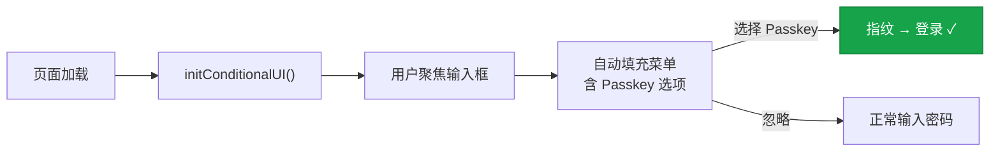

# 11 - 实战：服务端与客户端实现

## 11.1 技术栈选择

本课展示一个完整的 Passkey 实现：

- **前端**：原生 JavaScript（无框架，聚焦 WebAuthn API）
- **后端**：Python + Flask（逻辑清晰，方便理解）
- **库**：`py_webauthn`（处理 CBOR 解码、签名验证等底层细节）

:::warning
生产环境中，强烈建议使用成熟的服务端 WebAuthn 库，而不是手动实现 CBOR 解析和签名验证。
:::

---

## 11.2 主流 WebAuthn 服务端库

| 语言 | 库 | 备注 |
|------|----|------|
| Python | `py_webauthn` | 最流行的 Python 实现 |
| Node.js | `@simplewebauthn/server` | 配套有 `@simplewebauthn/browser` |
| Go | `go-webauthn/webauthn` | 原 `duo-labs/webauthn` |
| Java | `java-webauthn-server` (Yubico) | 企业级 |
| Ruby | `webauthn-ruby` | Rails 友好 |
| .NET | `Fido2NetLib` | ASP.NET 集成 |
| Rust | `webauthn-rs` | 类型安全 |
| PHP | `web-auth/webauthn-framework` | Symfony 集成 |

---

## 11.3 前端：注册流程

```javascript
async function registerPasskey() {
  // 第一步：从服务器获取注册选项
  const optionsRes = await fetch('/api/register/begin', {
    method: 'POST',
    headers: { 'Content-Type': 'application/json' },
    body: JSON.stringify({ username: 'alice@example.com' })
  });
  const options = await optionsRes.json();

  // 第二步：将 base64url 编码的字段转换为 ArrayBuffer
  options.challenge = base64urlToBuffer(options.challenge);
  options.user.id = base64urlToBuffer(options.user.id);
  if (options.excludeCredentials) {
    options.excludeCredentials = options.excludeCredentials.map(cred => ({
      ...cred,
      id: base64urlToBuffer(cred.id)
    }));
  }

  // 第三步：调用 WebAuthn API（浏览器弹出 Passkey 创建对话框）
  let credential;
  try {
    credential = await navigator.credentials.create({ publicKey: options });
  } catch (err) {
    if (err.name === 'NotAllowedError') {
      console.log('用户取消了操作');
      return;
    }
    throw err;
  }

  // 第四步：将结果发送给服务器
  const result = await fetch('/api/register/complete', {
    method: 'POST',
    headers: { 'Content-Type': 'application/json' },
    body: JSON.stringify({
      id: credential.id,
      rawId: bufferToBase64url(credential.rawId),
      type: credential.type,
      response: {
        clientDataJSON: bufferToBase64url(credential.response.clientDataJSON),
        attestationObject: bufferToBase64url(credential.response.attestationObject),
        transports: credential.response.getTransports?.() || []
      }
    })
  });

  const data = await result.json();
  if (data.status === 'ok') {
    console.log('Passkey 注册成功！');
  }
}
```

<details>
<summary>辅助函数：base64url ↔ ArrayBuffer</summary>

```javascript
function base64urlToBuffer(base64url) {
  const base64 = base64url.replace(/-/g, '+').replace(/_/g, '/');
  const padLen = (4 - base64.length % 4) % 4;
  const padded = base64 + '='.repeat(padLen);
  const binary = atob(padded);
  const buffer = new Uint8Array(binary.length);
  for (let i = 0; i < binary.length; i++) {
    buffer[i] = binary.charCodeAt(i);
  }
  return buffer.buffer;
}

function bufferToBase64url(buffer) {
  const bytes = new Uint8Array(buffer);
  let binary = '';
  for (const byte of bytes) {
    binary += String.fromCharCode(byte);
  }
  return btoa(binary).replace(/\+/g, '-').replace(/\//g, '_').replace(/=+$/, '');
}
```

</details>

---

## 11.4 前端：认证流程

```javascript
async function loginWithPasskey() {
  // 第一步：获取认证选项（不传用户名 = 无用户名登录）
  const optionsRes = await fetch('/api/auth/begin', { method: 'POST' });
  const options = await optionsRes.json();

  // 第二步：转换编码
  options.challenge = base64urlToBuffer(options.challenge);
  if (options.allowCredentials) {
    options.allowCredentials = options.allowCredentials.map(cred => ({
      ...cred,
      id: base64urlToBuffer(cred.id)
    }));
  }

  // 第三步：调用 WebAuthn API（弹出 Passkey 选择器 + 生物特征验证）
  const assertion = await navigator.credentials.get({ publicKey: options });

  // 第四步：发送给服务器验证
  const result = await fetch('/api/auth/complete', {
    method: 'POST',
    headers: { 'Content-Type': 'application/json' },
    body: JSON.stringify({
      id: assertion.id,
      rawId: bufferToBase64url(assertion.rawId),
      type: assertion.type,
      response: {
        clientDataJSON: bufferToBase64url(assertion.response.clientDataJSON),
        authenticatorData: bufferToBase64url(assertion.response.authenticatorData),
        signature: bufferToBase64url(assertion.response.signature),
        userHandle: assertion.response.userHandle
          ? bufferToBase64url(assertion.response.userHandle)
          : null
      }
    })
  });

  const data = await result.json();
  if (data.status === 'ok') {
    console.log('登录成功！用户：' + data.username);
  }
}
```

---

## 11.5 前端：Conditional UI（自动填充）

```html
<!-- HTML：注意 autocomplete 属性 -->
<input type="text" autocomplete="username webauthn" placeholder="用户名" />
```

```javascript
async function initConditionalUI() {
  // 检查浏览器是否支持
  if (!window.PublicKeyCredential ||
      !PublicKeyCredential.isConditionalMediationAvailable) {
    return;
  }
  const available = await PublicKeyCredential.isConditionalMediationAvailable();
  if (!available) return;

  const optionsRes = await fetch('/api/auth/begin', { method: 'POST' });
  const options = await optionsRes.json();
  options.challenge = base64urlToBuffer(options.challenge);

  try {
    const assertion = await navigator.credentials.get({
      publicKey: options,
      mediation: "conditional"    // ★ 不弹模态框，显示在自动填充中
    });
    await verifyAssertion(assertion);  // 走正常验证流程
  } catch (err) {
    // 用户选择了手动输入密码，正常行为
  }
}

document.addEventListener('DOMContentLoaded', initConditionalUI);
```



---

## 11.6 后端：使用 py_webauthn（Python）

```python
from flask import Flask, request, session, jsonify
from webauthn import (
    generate_registration_options,
    verify_registration_response,
    generate_authentication_options,
    verify_authentication_response,
    options_to_json,
)
from webauthn.helpers.structs import (
    AuthenticatorSelectionCriteria,
    ResidentKeyRequirement,
    UserVerificationRequirement,
    PublicKeyCredentialDescriptor,
)
from webauthn.helpers import bytes_to_base64url, base64url_to_bytes
import os

app = Flask(__name__)
app.secret_key = os.urandom(32)

RP_ID = "example.com"
RP_NAME = "Example Corp"
ORIGIN = "https://example.com"

# 模拟数据库（生产环境请用真正的数据库）
users_db = {}
credentials_db = {}


# ==================== 注册 ====================

@app.route('/api/register/begin', methods=['POST'])
def register_begin():
    username = request.json['username']
    user_id = users_db.get(username, {}).get('user_id_bytes', os.urandom(32))

    existing_credentials = [
        PublicKeyCredentialDescriptor(id=base64url_to_bytes(cred_id))
        for cred_id, cred in credentials_db.items()
        if cred['username'] == username
    ]

    options = generate_registration_options(
        rp_id=RP_ID,
        rp_name=RP_NAME,
        user_id=user_id,
        user_name=username,
        user_display_name=username.split('@')[0],
        authenticator_selection=AuthenticatorSelectionCriteria(
            resident_key=ResidentKeyRequirement.REQUIRED,
            user_verification=UserVerificationRequirement.REQUIRED,
        ),
        exclude_credentials=existing_credentials,
    )

    session['current_challenge'] = bytes_to_base64url(options.challenge)
    session['registering_username'] = username
    session['registering_user_id'] = bytes_to_base64url(user_id)

    return options_to_json(options)


@app.route('/api/register/complete', methods=['POST'])
def register_complete():
    body = request.json

    try:
        verification = verify_registration_response(
            credential=body,
            expected_challenge=base64url_to_bytes(session['current_challenge']),
            expected_rp_id=RP_ID,
            expected_origin=ORIGIN,
            require_user_verification=True,
        )
    except Exception as e:
        return jsonify({"status": "error", "message": str(e)}), 400

    username = session['registering_username']
    cred_id_b64 = bytes_to_base64url(verification.credential_id)

    credentials_db[cred_id_b64] = {
        'username': username,
        'user_id': session['registering_user_id'],
        'public_key': bytes_to_base64url(verification.credential_public_key),
        'sign_count': verification.sign_count,
        'credential_id': verification.credential_id,
        'transports': body.get('response', {}).get('transports', []),
    }

    users_db[username] = {
        'username': username,
        'user_id_bytes': base64url_to_bytes(session['registering_user_id']),
    }

    del session['current_challenge']
    del session['registering_username']
    del session['registering_user_id']

    return jsonify({"status": "ok"})


# ==================== 认证 ====================

@app.route('/api/auth/begin', methods=['POST'])
def auth_begin():
    options = generate_authentication_options(
        rp_id=RP_ID,
        user_verification=UserVerificationRequirement.REQUIRED,
    )
    session['current_challenge'] = bytes_to_base64url(options.challenge)
    return options_to_json(options)


@app.route('/api/auth/complete', methods=['POST'])
def auth_complete():
    body = request.json
    cred_id_b64 = body['id']

    credential = credentials_db.get(cred_id_b64)
    if not credential:
        return jsonify({"status": "error", "message": "Unknown credential"}), 400

    try:
        verification = verify_authentication_response(
            credential=body,
            expected_challenge=base64url_to_bytes(session['current_challenge']),
            expected_rp_id=RP_ID,
            expected_origin=ORIGIN,
            credential_public_key=base64url_to_bytes(credential['public_key']),
            credential_current_sign_count=credential['sign_count'],
            require_user_verification=True,
        )
    except Exception as e:
        return jsonify({"status": "error", "message": str(e)}), 400

    credential['sign_count'] = verification.new_sign_count
    del session['current_challenge']
    session['user'] = credential['username']

    return jsonify({"status": "ok", "username": credential['username']})
```

---

## 11.7 关键实现细节

### base64url 编码

WebAuthn 使用 base64url（不是标准 base64）：用 `-` 替代 `+`，用 `_` 替代 `/`，去掉末尾的 `=` 填充。原因：URL 安全，JSON 安全。

### Challenge 的存储和验证

:::danger[安全要求]
1. Challenge 必须存储在**服务端**（session / Redis）— 不能只存客户端
2. 验证后**立即删除** — 不能重复使用（否则签名可重放）
3. 应设置**过期时间**（建议 5 分钟）
4. 应**绑定到当前会话** — 不能跨会话使用
:::

### RP ID 的配置

| | 做法 | 说明 |
|---|------|------|
| ✗ | `"https://example.com"` | 不是 URL，是域名！ |
| ✗ | `"login.example.com"` | 限制了只能在子域使用 |
| ✓ | **`"example.com"`** | 所有子域都能使用 |

---

## 11.8 生产环境检查清单

### 安全

- [ ] 使用 HTTPS（WebAuthn 要求安全上下文）
- [ ] Challenge ≥16 字节（推荐 32），随机，服务端存储，一次性
- [ ] 验证 origin 在允许列表中
- [ ] 验证 rpIdHash 匹配
- [ ] 验证 type 字段（`"webauthn.create"` / `"webauthn.get"`）
- [ ] 验证 UP 和 UV 标志
- [ ] 使用成熟的 WebAuthn 库

### 用户体验

- [ ] 实现 Conditional UI（自动填充 Passkey）
- [ ] 提供密码回退（渐进式部署）
- [ ] 引导用户注册多个 Passkey
- [ ] 存储 transports 优化认证器选择 UI
- [ ] 提供清晰的错误信息

### 账户恢复

- [ ] 支持注册多个凭据
- [ ] 提供恢复码
- [ ] 定义恢复流程

### 监控

- [ ] 记录认证事件（成功/失败）
- [ ] 监控 signCount 异常
- [ ] 跟踪 BE/BS 标志变化

---

## 课程总结


:::tip[核心洞察]
Passkey 不是一个新产品，而是 **20 年密码学和标准化工作的成果**。它的每一个设计决策都有明确的安全理由。理解了这些理由，你就不只是在"使用" Passkey，而是真正理解了为什么无密码认证是可能的、安全的、必然的。
:::
