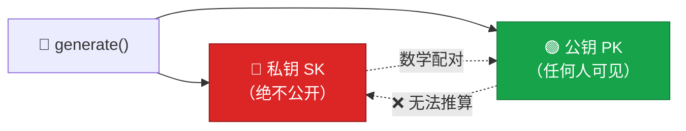
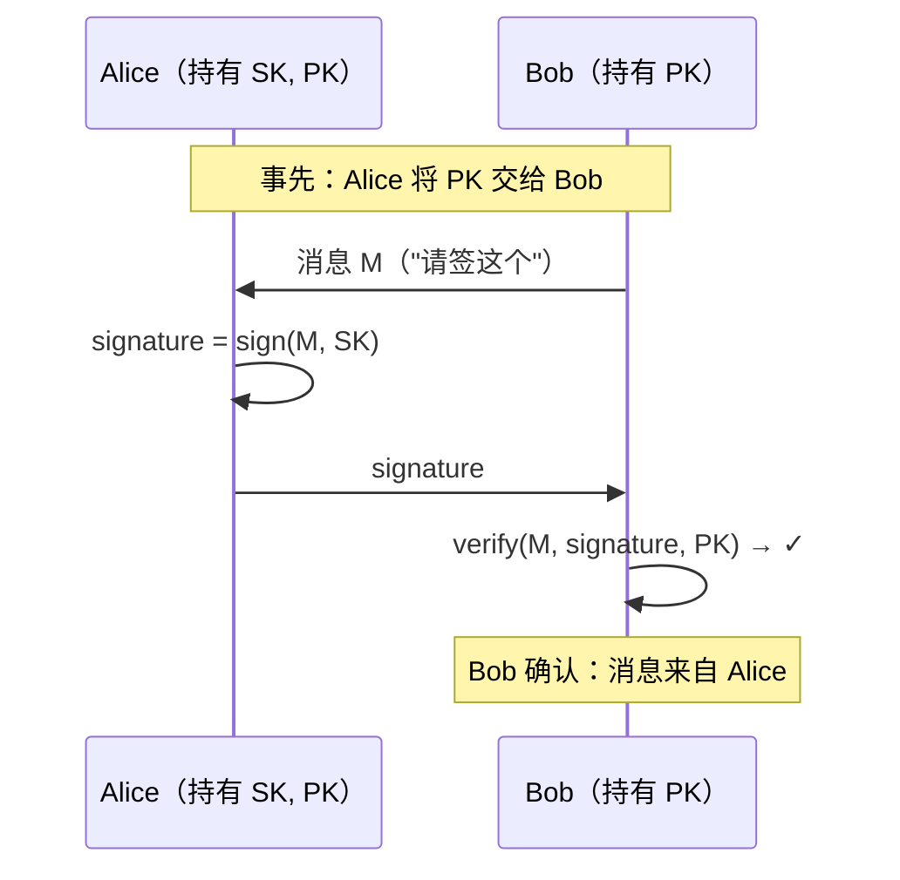
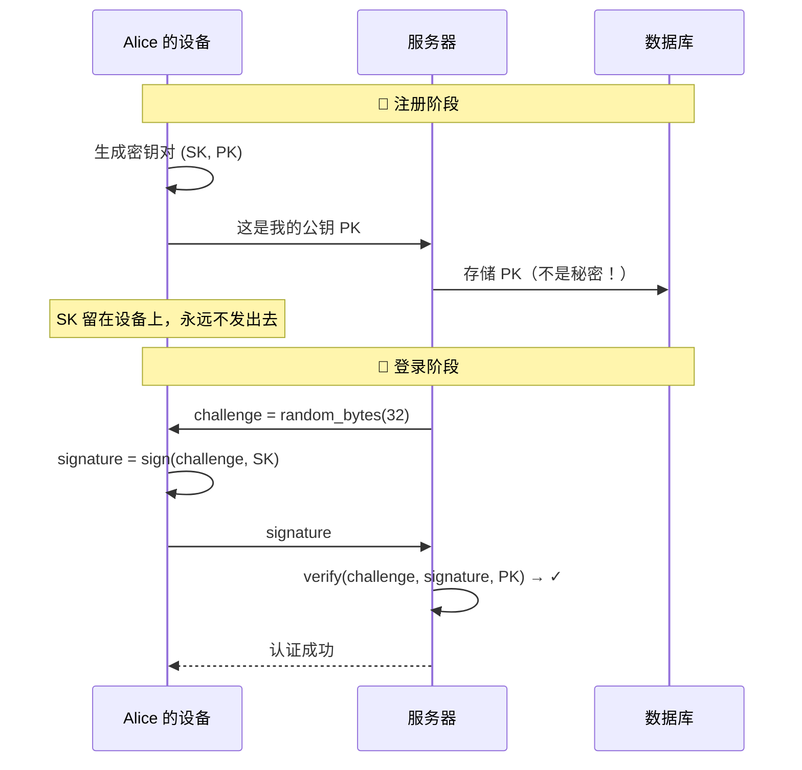
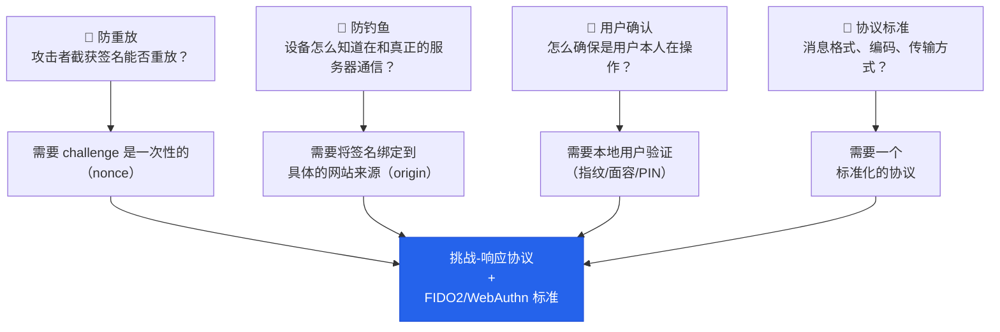

# 02 - 公钥密码学基础

## 2.1 对称 vs 非对称：两种密码学范式

### 对称密码学（Symmetric Cryptography）

一把钥匙，加密解密都用它：

```
encrypt(明文, 密钥K) → 密文
decrypt(密文, 密钥K) → 明文
```

> 问题：Alice 和 Bob 必须事先共享密钥 K → 这就是"共享秘密"，和密码模型同病相怜。

### 非对称密码学（Asymmetric / Public-Key Cryptography）

两把钥匙，数学上配对，但不能互相推导：



这两把钥匙可以做两件事：

| 操作 | 用哪把钥匙 | 目的 |
|------|-----------|------|
| 加密 | 公钥加密，私钥解密 | 保密性：只有私钥持有者能读 |
| **签名** | **私钥签名，公钥验证** | **认证：证明消息来自私钥持有者** |

:::tip[核心]

对于认证，我们关心的是**签名**，不是加密。

:::

---

## 2.2 数字签名：不泄露秘密的身份证明

### 签名过程



### 关键安全性质

| 性质 | 说明 |
|------|------|
| 私钥不离手 | 传输的是签名，不是秘密 |
| 签名绑定消息 | 不能把签名"移植"到其他消息上 |
| 不可伪造 | 没有私钥就无法伪造签名——即使看到一万个签名也不行 |
| 公钥可公开 | 验证者只需公钥——公钥泄露无所谓，它本来就是公开的 |

:::info[对比密码模型]

密码认证中，验证者（服务器）和证明者（用户）**都知道秘密**。签名认证中，验证者只有公钥，**秘密只存在于证明者一侧**。

:::

---

## 2.3 常见签名算法

WebAuthn/Passkey 生态主要使用以下算法：

| 算法 | 基础 | 密钥/签名大小 | COSE ID | 在 WebAuthn 中的地位 |
|------|------|--------------|---------|---------------------|
| **ECDSA P-256** | 椭圆曲线离散对数 | 256b 私钥 / ~64B 签名 | `-7` | 最广泛支持，首选 |
| **Ed25519** | Curve25519 | 256b 私钥 / 64B 签名 | `-8` | 推荐，但硬件支持稍少 |
| **RSA-PSS** | 大整数因式分解 | 2048+b / 256B 签名 | `-37` | 向后兼容用 |

:::note

你不需要深入理解这些算法的数学原理。只需知道：它们都实现了"用私钥签名、用公钥验证"的能力，且在当前计算技术下是安全的。

:::

---

## 2.4 把公钥密码学映射到认证场景

现在我们把密码认证替换为公钥认证：



### 对比两种模型

| | 密码模型 | 公钥模型 |
|---|---------|---------|
| 服务器存什么 | 密码哈希（泄露可离线破解） | **公钥（泄露无影响）** |
| 登录时传输什么 | 密码明文 | **签名（一次性的，不含秘密）** |
| 服务端被攻破 | 所有用户凭据可能泄露 | **公钥泄露无用，无法伪造签名** |
| 能否钓鱼 | 能（用户"说出"密码） | 取决于协议设计（下一课） |
| 凭据重用 | 常见（人类行为） | 协议可强制每站点不同密钥对 |

---

## 2.5 还差什么？

公钥模型解决了密码的存储和传输问题，但还有几个问题需要回答：



---

## 本课要点

:::note[总结]

- 非对称密码学 = 一对密钥（私钥签名，公钥验证）
- 数字签名让你「不泄露秘密就能证明身份」
- 服务器只存公钥 → 数据库泄露不影响安全性
- 登录只传签名 → 传输中没有秘密
- WebAuthn 主要使用 **ECDSA P-256** 和 **Ed25519**
- 还差：防重放、防钓鱼、用户确认、标准协议

:::

> **下一课**：[03 - 挑战-响应认证模型](/docs/03-挑战-响应认证模型)
