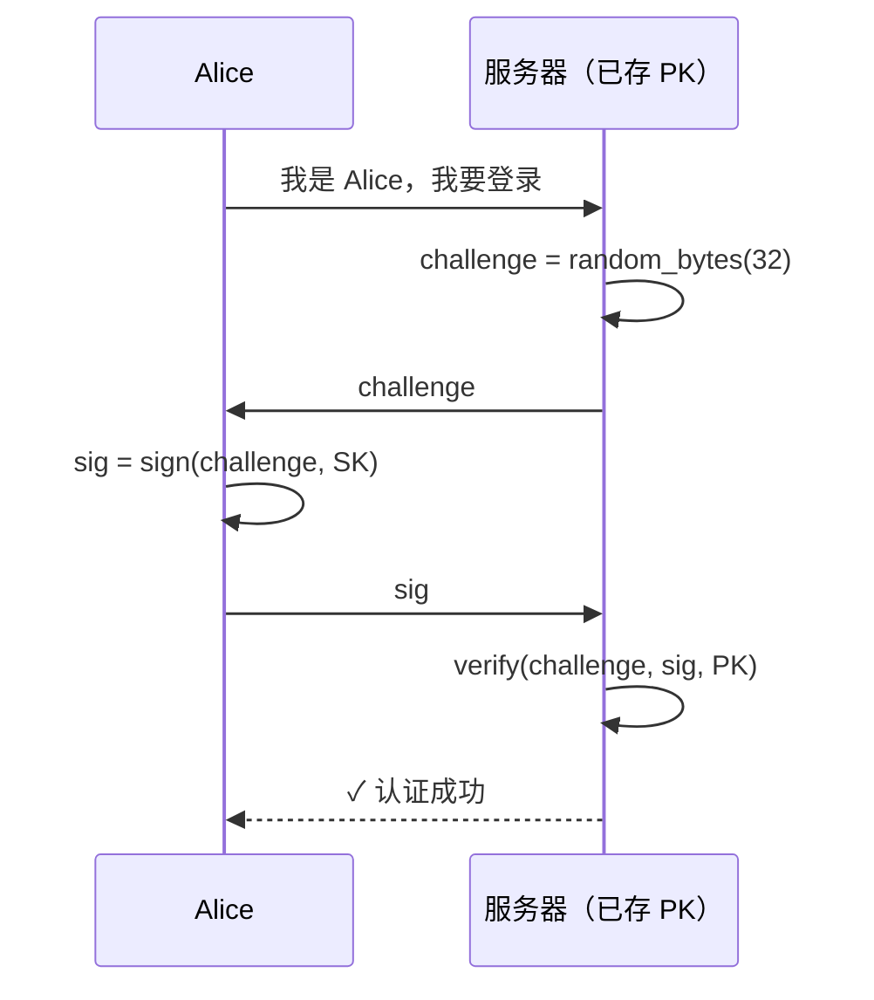
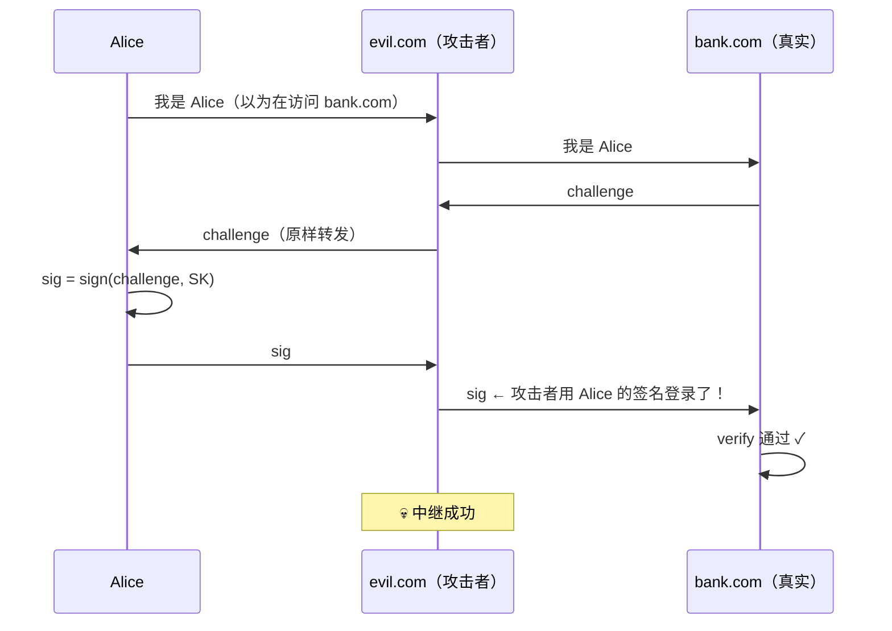
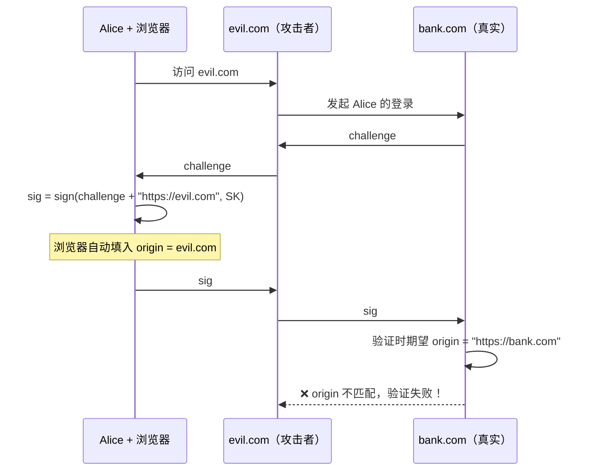
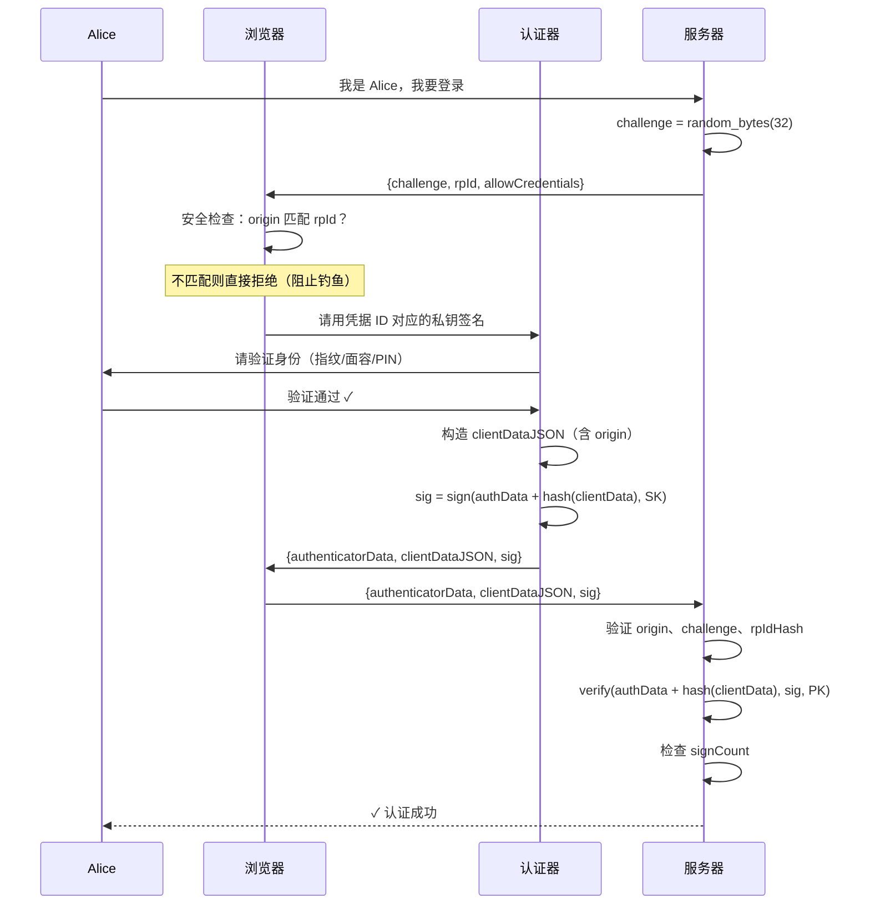
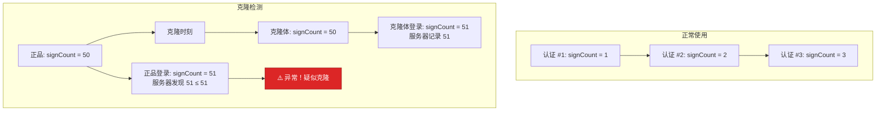

# 03 - 挑战-响应认证模型

## 3.1 最简挑战-响应协议

上一课我们得到了公钥认证的雏形。现在把它形式化：



**为什么要用随机挑战？** 如果每次签名的内容都一样，攻击者截获一次签名就能无限重放。随机挑战确保每次签名都不同——重放旧签名无法通过验证，因为挑战已经变了。

---

## 3.2 攻击分析：这个简单版本还有什么漏洞？

### 攻击一：钓鱼中继（Phishing Relay）



:::danger

问题：签名只绑定了 challenge，没有绑定"你在和谁通信"。

:::

### 攻击二：恶意软件代签

如果恶意软件可以直接调用设备上的签名功能，无需用户参与，那用户不知情时就被"登录"了。

---

## 3.3 解决方案：在签名中绑定上下文

### 绑定来源（Origin Binding）— 解决钓鱼

签名时不仅签 challenge，还要签"我在和哪个网站通信"：

```
签名内容 = sign(challenge + origin, SK)
其中 origin = "https://bank.com"（由浏览器提供，JavaScript 无法篡改）
```

现在钓鱼中继攻击失效了：



:::tip[关键]

origin 由浏览器/操作系统提供，不由 JavaScript 或用户控制。这就是为什么 WebAuthn **必须在浏览器层面实现**，而不能是一个纯 JavaScript 库。

:::

### 用户验证（User Verification）— 解决恶意软件

在签名之前，设备要求用户进行本地验证：

- 触摸物理按键（YubiKey）
- 指纹识别（Touch ID / 指纹传感器）
- 面容识别（Face ID）
- 输入设备 PIN

这确保签名操作是用户主动触发的，而不是后台程序偷偷执行的。

---

## 3.4 完善的挑战-响应协议

把上述改进加入后的完整协议：



---

## 3.5 为什么签名计数器（Sign Counter）很重要



:::note

不能**防止**克隆，但能**检测**克隆。Passkey（同步凭据）的计数器通常为 0 或不递增，因为同步本身就是"合法的克隆"。这在第 09 课详述。

:::

---

## 3.6 协议的安全性质总结

| 威胁 | 防御机制 |
|------|----------|
| 密码泄露 | 不存在密码。服务器只存公钥 |
| 数据库泄露 | 公钥泄露无法伪造签名 |
| 网络窃听 | 传输的签名是一次性的，无法重用 |
| 重放攻击 | 随机挑战（nonce）确保每次签名唯一 |
| 钓鱼 | origin 由浏览器绑定，钓鱼站点的 origin 不匹配 |
| 中间人攻击 | challenge + origin 绑定使中继无效 |
| 凭据克隆 | 签名计数器检测 |
| 恶意软件代签 | 用户验证（UV）要求物理交互 |
| 跨站点追踪 | 每个站点使用独立密钥对，无法关联 |

---

## 本课要点

:::note[总结]

- 挑战-响应 = 服务器出随机题，设备用私钥签名作答
- 仅签 challenge 不够 → 钓鱼中继攻击
- 签名必须绑定 origin → **浏览器层面阻止钓鱼（这是核心创新！）**
- 用户验证确保是本人在操作
- 签名计数器可检测凭据克隆
- 完整协议 = challenge + origin binding + user verification + sign counter

:::

> **下一课**：[04 - FIDO 联盟与标准演进](/docs/04-FIDO联盟与标准演进)
