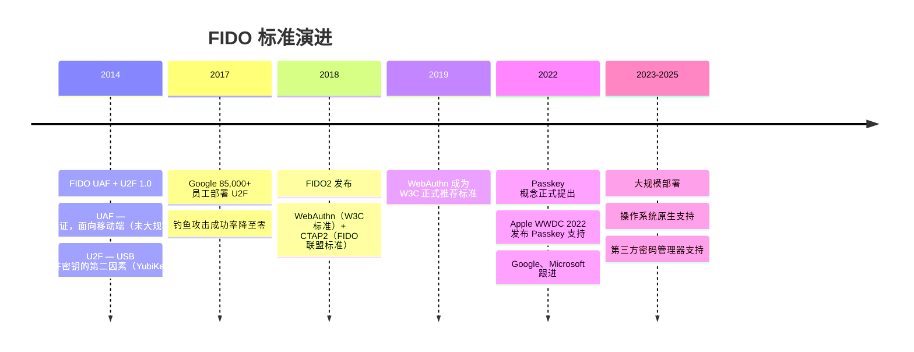
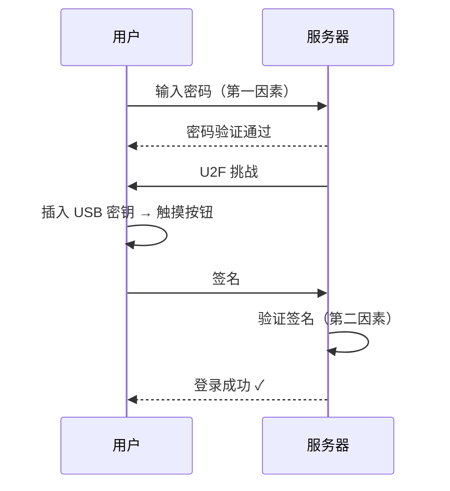
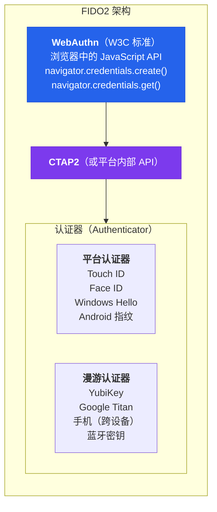
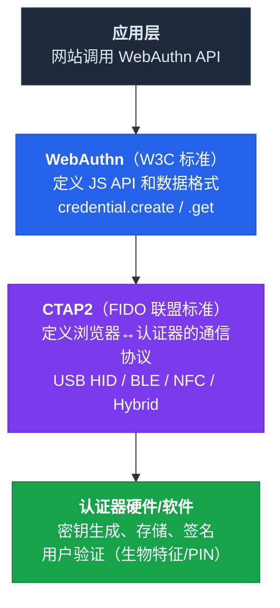

# 04 - FIDO 联盟与标准演进

## 4.1 FIDO 联盟是谁？

**FIDO = Fast IDentity Online**（线上快速身份认证）

FIDO 联盟成立于 2012 年，是一个开放的行业联盟，成员包括 Google、Apple、Microsoft（三大平台厂商）、Amazon、Meta、Intel、Qualcomm、Samsung、Visa、Mastercard、PayPal（支付行业）、银行、政府机构、安全厂商（Yubico 等）。

使命：制定开放标准，减少世界对密码的依赖。

---

## 4.2 标准演进时间线



---

## 4.3 U2F：理解前身

U2F 是理解 FIDO2 的重要前置知识。

### U2F 的工作方式



### U2F 的成就

- **Google 的案例**（2017 年）：85,000+ 员工部署 U2F 硬件密钥后，**钓鱼攻击成功率降至零**
- 证明了基于公钥的认证在实践中有效
- 培养了硬件密钥生态（YubiKey、Google Titan 等）

### U2F 的局限

| 局限 | 说明 |
|------|------|
| 只是第二因素 | 仍然需要先输入密码 |
| 需要专门的硬件 | 用户必须购买和携带 USB 密钥 |
| 用户体验不够好 | 每次登录要插拔设备 |
| 丢失密钥 = 被锁定 | 没有恢复机制 |

---

## 4.4 FIDO2：大统一

FIDO2 = WebAuthn + CTAP2，是对 U2F 和 UAF 的统一升级：



### FIDO2 相比 U2F 的关键进步

| 方面 | U2F | FIDO2 |
|------|-----|-------|
| 角色 | 仅第二因素 | **可作为唯一因素（无密码）** |
| 认证器 | 仅外部硬件 | **平台内置（指纹/面容）+ 外部硬件** |
| 用户验证 | 仅存在性验证（触摸） | **支持 PIN、生物特征** |
| 驻留凭据 | 不支持 | **支持（凭据存储在认证器内）** |
| 协议 | CTAP1 (U2F) | CTAP2（向后兼容 CTAP1） |
| 标准化 | FIDO 联盟规范 | **W3C 正式标准（WebAuthn）** |

---

## 4.5 关键概念：依赖方（Relying Party）

在 FIDO2 术语中，网站/服务被称为 **依赖方（Relying Party, RP）**：

```
依赖方 = 依赖认证器来验证用户身份的那一方 = 你的网站/应用/服务
```

:::warning[RP ID 规则]

- RP ID = 依赖方标识符 = 有效域名（例如：`example.com`）
- RP ID 必须是当前页面域名**或其父域名**
- `https://login.example.com` **可以**使用 RP ID `"example.com"`
- `https://login.example.com` **不能**使用 RP ID `"other.com"`
- 这是由浏览器强制执行的，不可绕过

:::

**RP ID 是防钓鱼的核心**——凭据在创建时绑定到 RP ID，只能在匹配的域名上使用。

---

## 4.6 关键概念：两类认证器

### 平台认证器（Platform Authenticator）

内置于设备中，不可移除。

| 平台 | 认证器 | 安全硬件 |
|------|--------|----------|
| macOS / iOS | Touch ID / Face ID | Secure Enclave |
| Windows | Windows Hello | TPM |
| Android | 指纹 / 面容 | TEE / StrongBox |

> 优点：无需额外硬件，用户体验好。缺点：绑定到特定设备（Passkey 同步解决了这个问题）。

### 漫游认证器（Roaming Authenticator）

外部设备，通过 USB / NFC / BLE 连接。

| 设备 | 连接方式 |
|------|----------|
| YubiKey 5 系列 | USB-A / USB-C / NFC |
| Google Titan | USB / BLE / NFC |
| 手机作为认证器 | BLE + 互联网混合传输 |

> 优点：可在多台设备间使用，物理隔离。缺点：需要购买和携带，可能丢失。

---

## 4.7 标准之间的关系总结



---

## 本课要点

:::note[总结]

- FIDO 联盟 = 行业联盟，推动无密码标准
- U2F（2014）= 硬件二因素，证明了公钥认证可行（Google 零钓鱼）
- FIDO2（2018）= WebAuthn + CTAP2，统一升级
  - 支持无密码（不只是第二因素）
  - 支持平台认证器（指纹/面容，无需外部硬件）
- RP ID = 域名绑定，防钓鱼的核心
- 认证器分两类：**平台**（内置）和**漫游**（外部）
- Passkey（2022）= 可同步的 FIDO2 凭据（第 09 课详述）

:::

> **下一课**：[05 - WebAuthn：浏览器中的公钥认证](/docs/05-WebAuthn浏览器中的公钥认证)
